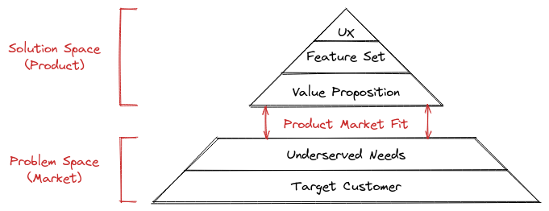

# Product Market Fit (PMF) Pyramid

## Notes

- There are **five** components of the product market fit (PMF) pyramid. According to Dan Olsen, they are:
  - Your **target** customer
  - Your customer's under-served needs
  - Your value proposition
  - Your feature set
  - User experience

## References
